# Outpace: Advanced Strava Dashboard

Outpace is a comprehensive web application that enhances your Strava experience by providing advanced visualization and analytics features. Create personalized dashboards with multi-day trip detection, global activity heatmaps, detailed statistics, and more.

## Features

- **Multi-Day Trip Detection**: Automatically identifies and groups activities that form part of a longer journey
- **Global Heatmap**: Visualize all your activities on a single map to see your global footprint
- **Activity Statistics**: Get detailed insights into your performance metrics
- **Pinned Activities**: Highlight your favorite or most significant activities
- **Shareable Dashboards**: Generate links to share your dashboard with friends and family
- **Elevation Data**: Enhanced elevation profiles and statistics

## Architecture

The application follows a modern web architecture with a React frontend and FastAPI backend, using PostgreSQL for data storage.

```mermaid
graph TD
    %% User Interaction
    User[User] --> WebUI[React Web UI]
    
    %% Frontend Components
    WebUI --> Router[AppRouter]
    Router --> Pages[React Pages]
    Pages --> Components[React Components]
    
    %% Authentication Flow
    WebUI --> StravaAuth[Strava Authentication]
    StravaAuth --> StravaAPI[Strava API]
    StravaAPI --> StravaRedirect[Strava Redirect]
    StravaRedirect --> TokenRegistration[Register Token]
    
    %% Backend Services
    WebUI <--> FastAPI[FastAPI Backend]
    FastAPI --> Endpoints[API Endpoints]
    
    %% Database Interactions
    FastAPI --> Database[(PostgreSQL Database)]
    Database --> Models[Database Models]
    Models --> RefreshToken[RefreshToken Model]
    Models --> AthleteSLAT[AthleteSLAT Model]
    Models --> Activity[Activity Model]
    Models --> Trip[Trip Model]
    Models --> Dashboard[Dashboard Model]
    
    %% Core Functionality
    FastAPI --> ActivityProcessing[Activity Processing]
    ActivityProcessing --> TripDetection[Trip Detection]
    ActivityProcessing --> ElevationComputation[Elevation Computation]
    
    %% External Services
    ElevationComputation --> ExternalElevationAPI[External Elevation API]
    TripDetection --> Geocoding[Nominatim Geocoding]
    
    %% Dashboard Features
    WebUI --> DashboardView[Dashboard View]
    DashboardView --> Heatmap[Global Heatmap]
    DashboardView --> TripView[Trip View]
    DashboardView --> ActivityStats[Activity Statistics]
    DashboardView --> PinnedActivities[Pinned Activities]
    
    %% Data Sharing
    DashboardView --> ShareDashboard[Share Dashboard]
    ShareDashboard --> TokenGeneration[Token Generation]
    TokenGeneration --> SharedDashboard[Shared Dashboard URL]
    
    %% Background Tasks
    FastAPI --> BackgroundTasks[Background Tasks]
    BackgroundTasks --> FetchElevations[Fetch Elevations]
    BackgroundTasks --> ProcessActivities[Process Activities]
    
    %% Subgraphs for organization
    subgraph "Frontend (React)"
        WebUI
        Router
        Pages
        Components
        DashboardView
        Heatmap
        TripView
        ActivityStats
        PinnedActivities
        StravaRedirect
    end
    
    subgraph "Backend (FastAPI)"
        FastAPI
        Endpoints
        ActivityProcessing
        TripDetection
        ElevationComputation
        BackgroundTasks
        FetchElevations
        ProcessActivities
        TokenRegistration
        TokenGeneration
    end
    
    subgraph "Database (PostgreSQL)"
        Database
        Models
        RefreshToken
        AthleteSLAT
        Activity
        Trip
        Dashboard
    end
    
    subgraph "External Services"
        StravaAPI
        StravaAuth
        ExternalElevationAPI
        Geocoding
    end
    
    %% Styling
    classDef frontend fill:#f9f,stroke:#333,stroke-width:2px
    classDef backend fill:#bbf,stroke:#333,stroke-width:2px
    classDef database fill:#dfd,stroke:#333,stroke-width:2px
    classDef external fill:#ffd,stroke:#333,stroke-width:2px
    
    class Frontend,WebUI,Router,Pages,Components,DashboardView,Heatmap,TripView,ActivityStats,PinnedActivities,StravaRedirect frontend
    class Backend,FastAPI,Endpoints,ActivityProcessing,TripDetection,ElevationComputation,BackgroundTasks,FetchElevations,ProcessActivities,TokenRegistration,TokenGeneration backend
    class Database,Models,RefreshToken,AthleteSLAT,Activity,Trip,Dashboard database
    class External,StravaAPI,StravaAuth,ExternalElevationAPI,Geocoding external
```



## Prerequisites

Before running Outpace, you'll need:

- Docker and Docker Compose
- A Strava API application (to get Client ID and Secret)
- A Mapbox account (for the access token)

## Setup

### 1. Clone the repository

```console
git clone https://github.com/toma-demagn/outpace.git
cd outpace
```

### 2. Configure environment variables

Create two `.env` files with your credentials:

**Root `.env` file** (for database configuration):

```
POSTGRES_USER=username
POSTGRES_PASSWORD=password
POSTGRES_DB=db_name
POSTGRES_PORT=5432
```

**`outpace-front/.env` file** (for frontend configuration):

```
REACT_APP_CLIENT_ID="your_strava_client_id"
REACT_APP_CLIENT_SECRET="your_strava_secret"
REACT_APP_HOST_URL="http://localhost:8000"
REACT_APP_MAPBOX_ACCESS_TOKEN="your_mapbox_token"
```

### 3. Run with Docker

With Docker running, start the application:

```console
docker-compose up
```

The application will be available at:
- Frontend: http://localhost:3000
- Backend API: http://localhost:8000

## Usage

1. Open the application in your browser
2. Log in with your Strava account
3. Allow the application to access your Strava data
4. Your activities will be automatically imported and processed
5. Explore your personalized dashboard with trips, heatmaps, and statistics
6. Share your dashboard using the generated link

## Development

### Project Structure

- `outpace-front/`: React frontend application
- `outpace-back/`: FastAPI backend application
- `docker-compose.yml`: Docker configuration for development

### Contributing

Contributions are welcome! Please feel free to submit a Pull Request.
